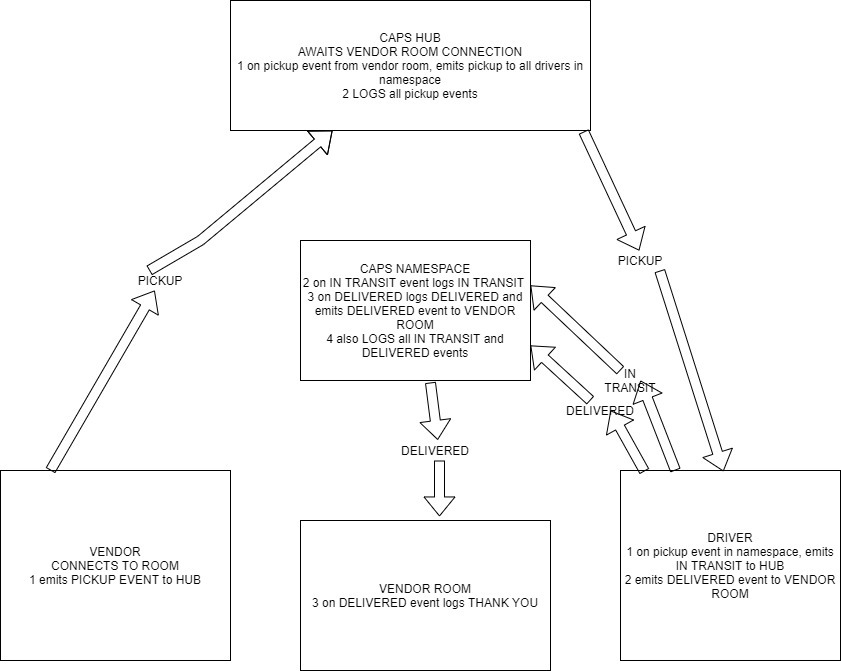

# CAPS

## Project:   Code Academy Parcel Services-CAPS

## Author: Edgar Romero

### Links and Resources

submission PR
ci/cd (GitHub Actions)
back-end server url (when applicable)
front-end application (when applicable)

### User Stories

* As a vendor, I want to alert the system when I have a package to be picked up
* As a driver, I want to be notified when there is a package to be delivered
* As a driver, I want to alert the system when I have picked up a package and it is in transit
* As a driver, I want to alert the system when a package has been delivered
* As a vendor, I want to be notified when my package has been delivered
### Setup
To initialize as an pnm project, run the following command:
`npm init -y`

Dependencies: 
```
"dependencies": {
    "@code-fellows/supergoose": "^1.0.11",
    "dotenv": "^8.2.0",
    "express": "^4.17.1",
    "faker": "^5.1.0",
    "jest": "^26.4.2",
    "socket.io": "^2.3.0",
    "socket.io-client": "^2.3.1"
```
and add a .env file to your repo, then set the port to 5000.
- `PORT=`

.env requirements (where applicable)


### How to initialize/run your application (where applicable)

--TO RUN THE APPLICATION--

In the Terminal(s) run:
`nodemon caps.js || node caps.js `

### Tests

Tests are handled with the jest testing library. Install jest to the dev dependencies. Follow the command:

`npm i --save-dev jest`

### UML


